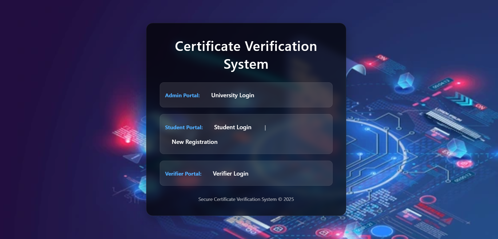
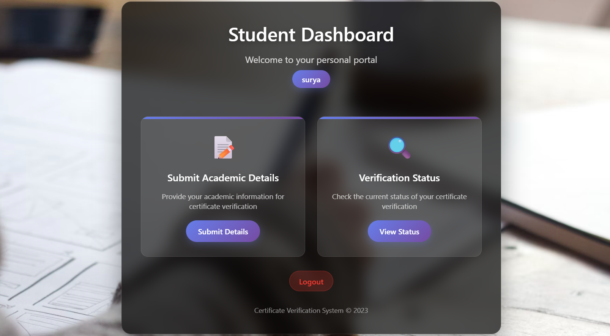
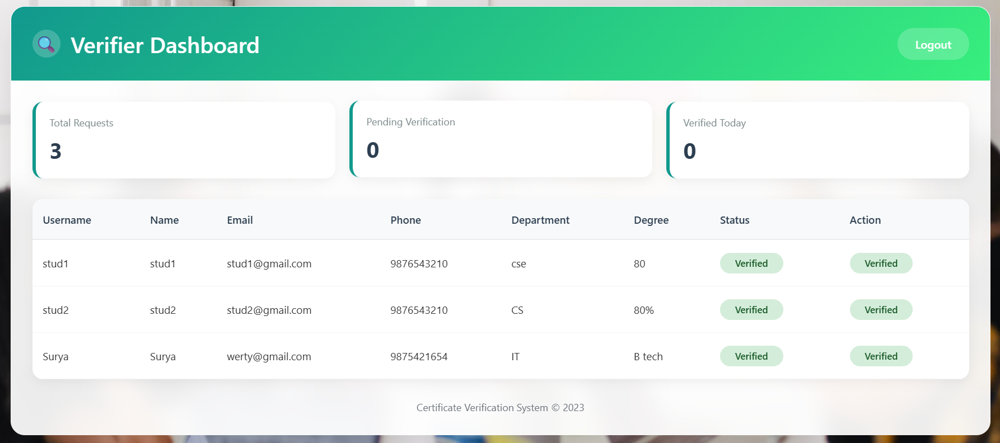
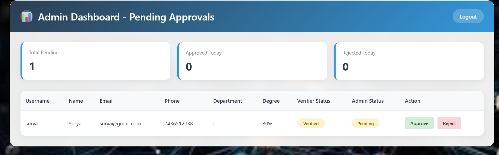

# Blockchain-Based Academic Certificate Verification System

A secure system for issuing and verifying academic certificates using 
blockchain technology, SHA-256 hashing, and RSA encryption — 
eliminating fraud and manual verification processes.

## Screenshots
### Dashboard View


### StudentDashboard View


### VerifierDashboard View


### AdminDashboard View


## Problem It Solves
Certificate fraud is a major issue in education and hiring. 
This system makes certificates tamper-proof by storing their 
hash on a blockchain — any modification to the certificate 
instantly invalidates it.

## Features
- Tamper-proof certificate storage using SHA-256 hashing
- RSA encryption for secure certificate signing
- Role-based access control — Admin, Student, Verifier
- Real-time certificate verification via unique hash lookup
- Web interface for certificate issuance and verification

## Tech Stack
| Layer | Technology |
|-------|-----------|
| Backend | Python, Flask |
| Blockchain | Custom blockchain implementation (blockchain.py) |
| Encryption | SHA-256, RSA |
| Database | SQLite |
| Frontend | HTML, CSS (Jinja2 templates) |

## How It Works
1. Admin issues a certificate → system generates SHA-256 hash
2. Hash is stored as a block in the blockchain
3. Verifier enters certificate ID → system checks hash against blockchain
4. If hash matches → Valid. If tampered → Invalid instantly.

## How to Run
```bash
pip install flask cryptography
python app.py
```
Open http://localhost:5000

## Team Project
**Thulasi Durai D** — B.Tech Information Technology, Sri Krishna College of Technology  
*(Final Year Group Project — 2025-2026)*

## My Contribution
- Designed the blockchain data structure with SHA-256 hashing 
  for tamper-proof certificate storage and verification
- Built the Flask backend and REST API for certificate 
  issuance and real-time verification workflows
- Implemented role-based access control for Admin, Student, 
  and Verifier roles with secure authentication